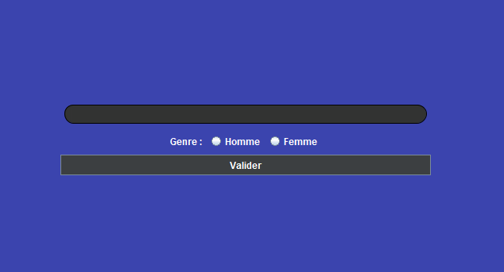
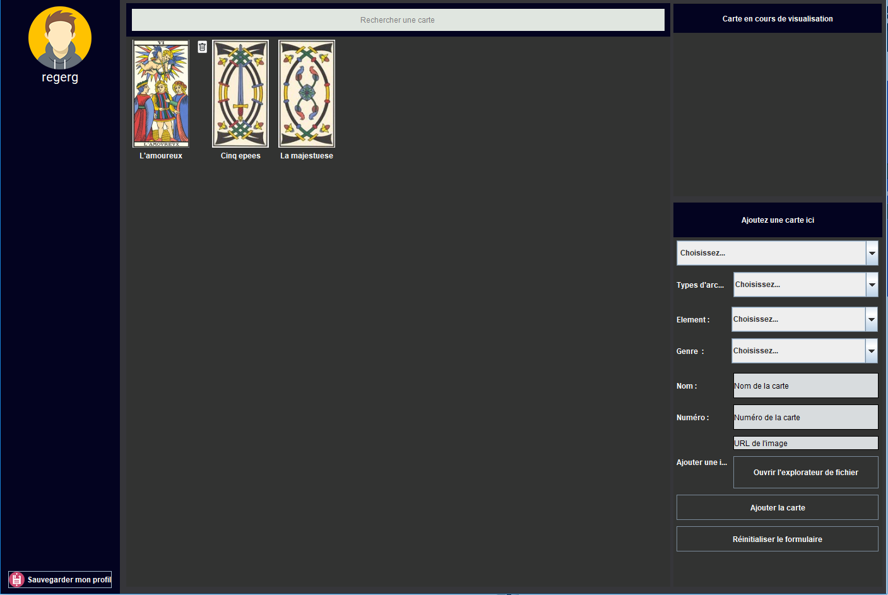
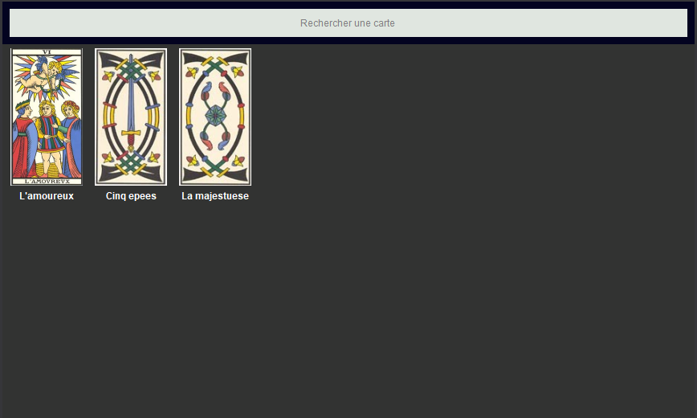
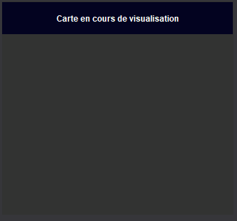
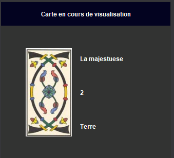
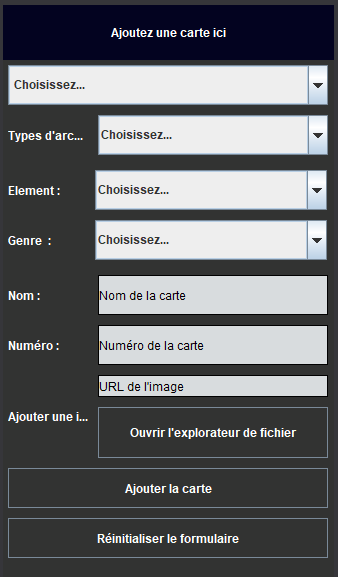

# Introduction

Before begin any typing, I’ve made some research in order to know more
about this "practice". And I’ve found all of what I needed here :
https://www.apprendre-tarotdemarseille.com/ (All the images I used for
the card are from this website by the way). Then I’ve decided to start
with Arcanes Mineures and Arcanes Majeures. And as I thought two classes
were not enought for basis of the project, I added one own-maded class.
Arcanes Majestueuse is it.(More details in this report below - Classes
Section) In a first hand I wrote all the classes that doesn’t belong to
the view part. So are they Player class, Card(Abstract class),
ArcanesMajeures, Arcanes Mineures, Arcanes Majestueuses. All of them
extended from Card Class. And all the view part was coded in a one
single page. As I thought it wasn’t really clean and properly coded I’ve
decided to start all the project over again. Then I’ve coded the project
by using the MVC design pattern, and the Observer principle. And there
is differents classes in the view part that represents differents
components of the application (Also more details in the report below)

# UML Diagram

See the Class Diagram png in RapportProjet directory

# How to use it

## 1 - Form Welcome Panel

Once the user has started the program, he has got to fill a welcome
form. He must enter his name and choose betwin two choices of a two
radioButton couple. Then he press enter and go into in.

## 2 - Main Window 

Then, once it’s done, the user can see the program
break down into segments.

### a - The SideBar
First you’ve got the side bar with a little icon, the name and at save
profil button at the bottom.

  

### b - The central panel - collection card and search bar
Then you can see a central panel. Here released a search bar and the card collection of the user.
Each card will be set with a respective image and a name.

By hovering one of these card, a dustbin icon will pop just on the left of the card image so you can remove the card from you're collection.

### c - The detail Panel

By clicking on one of these card you set the top-right panel : detail Panel. Here you will see the detail of the card you've just clicked on before.

 

By hovering each property value on the right of the image, a pen icon will pop  so you can set the property that belong to the icon.
JLabel will turn into JTextField or JComboBox. Depending on the nature of the property you're setting.
To validate your change, where the edit icon was a validate icon  is instead.

### d - The adding form

And finally the adding form there is. 
With this, you will can add new card to your collection.

There is different options : 
* You can add a card by choosing one of the default card. Once the choice done, the form will automaticaly be filled. Then you will be uncapable to modify the fields unless you click on the empty form button.
* Otherwise you can create your own card by choosing the item you want in the combobox  components and typing the right word in the text fields components. But the first combobox, the default card proposal, must remained unchoosen. It means the first item ("choisissez une carte") must be selected.

# The Project Structure
## 1 - The View - Package
This package contains all what's important for the user interface. 
### a - The Interfaces
These interfaces are required when the user trigger the event by using the linked component.
To do so, I've been thinking like that : there is one component that trigger the event and the event listener calls the corresponding method in the linked Panel which implements the needed interface. The bound between both component (component trigger, (interface)panel calling method) is created in a static HashMap set in the View Page. Most of the time the panel linked to the trigger component is the panel that contains the trigger component. But not for one time where the panel needed to be listen is send to the class that contains the trigger component. By doing like this you have juste two lines of code to write into the EventListener Classes. It doesn't matter which component add an event to his listener.
#### IGotBtnClickable
#### IGotBtnHover
#### IGotComboxChange
#### IGotFocusComponent
#### IGotTextFieldKeyListening
### b - The Classes
* View Page
   * FormPanelWelcome
     * RoundedJTextField
     * RoundedBorderCorner
   * PanelMainPage
     * PanelSideBar
     * PanelCollectionCard
       * CardPanel
       * CardIsJButton
     * PanelDetailCard
       * AsbtractPanelForArcanesType
       * PanelForArcanesMajestueuseDetail
       * PanelForArcanesMajeureDetail
       * PanelForArcanesMineureDetail
     * PanelFormAddCard
       * ListRenderer
  * EventListenerClasses
    * ButtonAction
    * ComboBoxAction
    * FocusAction
    * KeyPressedAction

## 2 - The Controller - Package
This package is like a ferryman. Every change triggered in the view package (by the user) will be set in the classes model package.
### The Classes
#### AbstractControllerPlayer
#### ControllerPlayer

## 3 - The Model - Package
### a - The Interfaces
This interface takes care of the sustainability of the essentials data and as for it, Player is the only class to implements the interface.
#### IsSustainable
### b - The Classes
#### AbstractModel
#### Player
#### Card
#### ArcanesMajeures
#### ArcanesMineures
#### ArcanesMajestueuses

## The Observer - Package
This package well carrying his name. Every oberved change in th model will reset the view. Once the change is set into the corresponding model class, the observable classes call the method ``notifyObserver(Player p)`` that inform all the observers.
### The Interfaces
#### Observable
#### Observer
